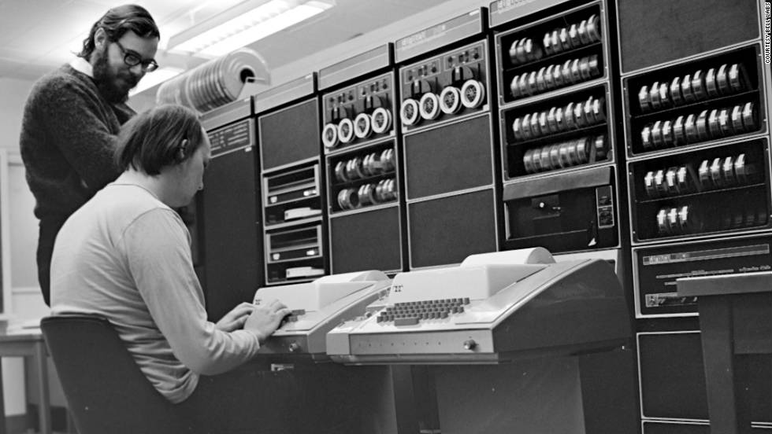

# Un poco de historia

El _shell_ que se va a usar en este curso se llama bash. Bash como
casi toda la computación moderna nace en Bell Labs (Hoy en día AT&T)
en los 80s con el desarrollo de UNIX. UNIX fue uno de los primeros
sistemas operativos modernos e influenció a casi todos los que hoy
conocemos, entre ellos MacOS y Linux.

La manera de interactuar con UNIX era a través de un teclado, y una
máquina de escribir conectada a un mainframe y una impresora que
imprimía en papel físico, línea por línea, los comandos que se
enviaban a UNIX. La impresora entonces escribía el output en papel
abajo de los comandos enviados.

El _shell_ que interpretaba estos comandos era bash![^1]. La terminal
era en ese entonces y sigue siendo ahora una herramienta muy poderosa
que permite interactuar con casi todo lo que el sistema operativo
puede ofrecer.  Desde navegación básica y creación de archivos hasta
configuración avanzada y programación de otros sistemas operativos
completos.

[^1]: Técnicamente aún no era bash, era su predecesor `sh` o Bourne
  shell por su creador Stephen Bourne. Bash es un acrónimo para
  **b**ourne **a**gain **sh**ell

Cada acción requiere llamar a pequeños programas, como `cd`, `ls`,
`cat`, etc... La filosofía de UNIX es escribir pequeños programas que
hace una y solo una cosa pero la hacen muy bien. Entonces interactuar
con bash es la mayoría del tiempo un ejercicio de pensar en las
mejores formas de juntar estos pequeños comandos para lograr lo que se
quiere, lo cual permite flexibilidad difícil de replicar.
