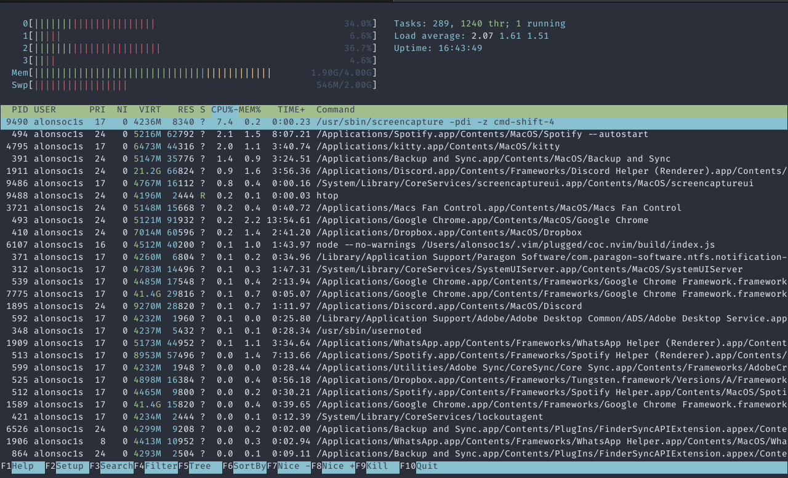
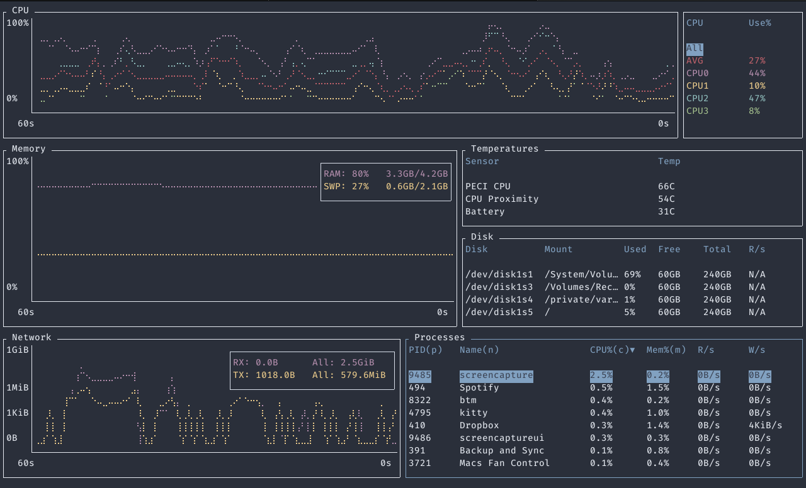

# La terminal es muy poderosa

El contenido de este capítulo es principalmente ejemplos de cosas muy
poderosas que se pueden lograr con la terminal. La mayoría construye
sobre comandos que ya se han mencionado en las notas. Dicho eso, no
siempre intentan ser claros, es un poco de motivación para perderle
miedo a la terminal.

## ¿Ya mero acabamos?

Entre muchas comunidades de personas que programan es común usar las
palabras FIXME y TODO (To Do) dentro de los comentarios de programas
para marcar cosas que quedan pendientes, posibles errores o cosas por
implementar. También es muy común que proyectos no-triviales estén
distribuidos a través de muchas carpetas y muchos archivos. En un solo
archivo se podría "usar `ctrl + f` para buscar apariciones de estas
palabras, pero hacerlo archivo por archivo es menos que deseable. El
problem se puede resolver así:

```bash
$ grep '# TODO\|# FIXME' */* | wc -l
24
```

El resultado es un número, el número de apariciones distintas de
líneas que contengan el string "TODO" O "FIXME". El comando `wc`
cuenta palabras (**w**ord **c**ount), y cuando se le da el modificador
`-l` cuenta líneas en vez de palabras.

## ¿Qué tanto escribí?

Usando a nuestro nuevo amigo `wc` podemos contar las palabras usadas
en un archivo de texto. Una vez más, es común tener proyectos
distribuidos en muchas carpetas, en muchos archivos, y correr `wc` uno
por uno no es divertido. Se puede hacer esto mejor:

```bash
$ wc *
wc: figs: read: Is a directory
	 138     817    4942 files.md
      55     319    1917 first_steps.md
      29     240    1451 historia.md
      28     222    1365 intro.md
      24     156    1004 meta.md
     302    1832   11584 nav.md
       1       3      19 next_steps.md
      99     691    4183 plumbing.md
       1       2      12 scripting.md
      28     195    1174 showoff.md
     104     736    4538 utils.md
     830    5274   32787 total
```

`wc` sin argumentos muestra de izquierda a derecha, el número de
líneas, el número de palabras y el número de bytes.

## Terminal User Interfaces

Hay una buena cantidad de personas que le tienen tanto cariño a su
terminal que han encontrado maneras de representar solo con texto
elementos gráficos con tal de monitorear su trabajo sin dejar la
terminal. Dos ejemplos notables son `htop`, y `btm`.

`htop` es una utilidad que muestra una gráfica de uso de los núcleos
de procesador y una lista de los procesos que están consumiendo más
memoria o poder de procesamiento. Se ve asi:



Por su parte, `btm` es un sucesor espiritual de `htop` y trata de
hacer lo mismo con más información y una interfaz "más moderna".



Ambos `htop` y `btm` tienen propósitos prácticos. Hay otros comandos
menos útiles, como `neofetch`:


O bien, cowsay, que es poco útil pero tierno:

```bash
$ cowsay "Espero que te hayan sido útiles estas notas"

 ________________________________________
/ Expero que te hayan sido útiles estas \
\ notas                                  /
 ----------------------------------------
        \   ^__^
         \  (oo)\_______
            (__)\       )\/\
                ||----w |
                ||     ||
```
